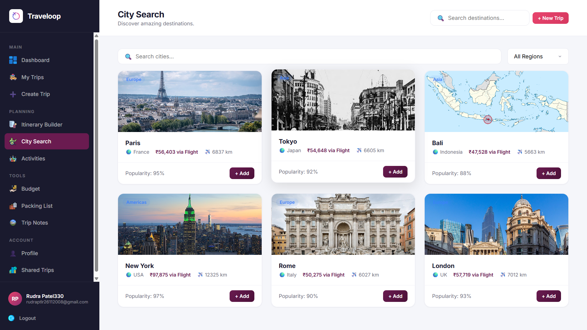
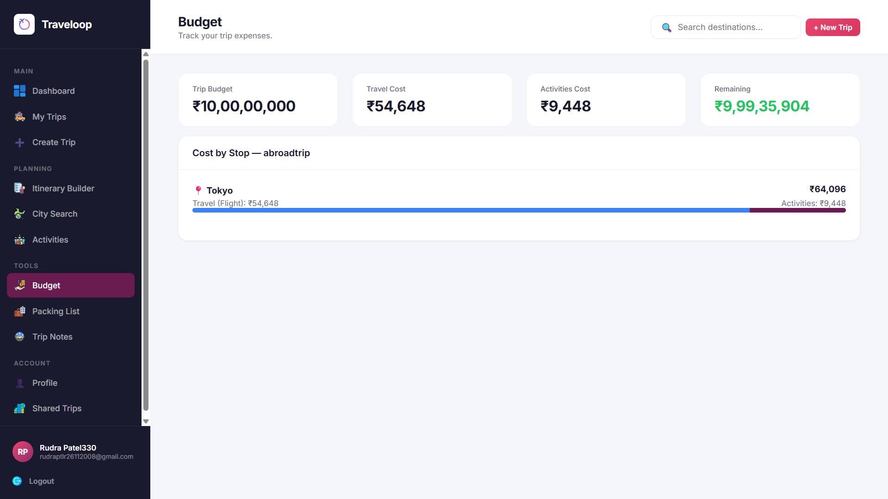

# ✈️ Traveloop — Multi-City Travel Planning Platform

> **Odoo × Parul University Hackathon — Problem Statement: Travel Loop**  
> Built by **Team VultureX**
---

---
A full-stack travel planning web app built with **Node.js + Express + PostgreSQL**. Plan multi-city trips, manage itineraries, track budgets, share your adventures, and administer the platform — all backed by a real database with session-based auth and Vercel deployment.

## ✨ Features

### 🔐 Authentication
- Sign up / Login with email & password (bcryptjs hashed)
- Google OAuth login via `google-auth-library`
- Session-based auth with PostgreSQL session store (`connect-pg-simple`)
- Profile editing (name, email, phone, language)
- Account deletion

### 🏠 Dashboard
- Summary stats: total trips, cities planned, upcoming trips, budget tracked
- Ongoing / upcoming / completed trip status with smart date detection
- Quick-access cards for popular cities (Paris, Tokyo, New York, Bali)
- One-click navigation to any trip's itinerary

### 🧳 Trip Management
- Create trips with name, description, dates, status, budget, and cover image
- Edit or delete trips
- Filter trips by status: Planning / Upcoming / Ongoing / Completed
- Each trip has its own stops, packing list, notes, and budget

### 📍 Add Stops (Multi-City Planning)
- Add multiple city stops to a trip with arrival/departure dates
- Mark stops as visited
- Delete individual stops

### 📋 Itinerary Builder
- Day-by-day timeline view across all stops
- All activities per stop with cost, duration, and type
- Total trip cost aggregated from all activities
---

---
### 🌍 City Search
- Browse a curated global city catalog (served from backend `/api/cities`)
- Search, filter by region and cost index
- Dynamic flight cost estimation via geolocation (ipapi.co)
- One-click "Add to Trip" — directly creates a stop

### 🎯 Activity Search
- Browse a curated activities catalog (`/api/catalog/activities`)
- Search activities in real time via Wikipedia API (`/api/activities/search`)
- Filter by type: Sightseeing, Food, Adventure, Culture, Shopping, Nightlife, Transport, Accommodation
- Add activities directly to trip stops
---

---
### 💰 Budget Tracker
- Set and track a total trip budget with category breakdown
- Visual spend indicators with over-budget alerts
- Inline budget editing

### 🎒 Packing List
- Add custom items with categories: Clothing, Documents, Electronics, Toiletries, Medicine, Other
- Check/uncheck items as you pack; reset all at once
- Progress bar showing packed vs. total count

### 📝 Trip Notes
- Create, edit, and delete notes linked to specific trips
- Timestamped entries (created + last updated)

### 🔗 Share Trip
- Toggle trips between Public and Private
- Auto-generated unique share ID per trip
- Public shareable URL via `/shared/:id`
- Public view rendered by `shared.html`

### 📊 Admin Dashboard (`admin.html`)
- Separate admin portal with Chart.js visualisations
- Platform stats: total users, total trips, public trips, top cities, recent activity
- User management: list all users, view their trips, delete accounts
- Top activities report
- Recent trips feed

---

## 🛠️ Tech Stack

| Layer | Technology |
|---|---|
| Backend | Node.js + Express.js |
| Database | PostgreSQL (via Supabase) |
| Auth | express-session + bcryptjs + Google OAuth |
| Sessions | connect-pg-simple (PostgreSQL session store) |
| Frontend | Vanilla HTML, CSS, JavaScript |
| Charts | Chart.js (admin dashboard) |
| Deployment | Vercel (`@vercel/node` + `@vercel/static`) |
| External APIs | Wikipedia API (activity search), ipapi.co (geolocation), Google Auth |

---

## 📁 Project Structure

```
VultureX-traveloop/
├── server.js                   # Express backend — all REST API routes + DB logic
├── index.html                  # Login / Signup page
├── app.html                    # Main app shell (sidebar + header layout)
├── admin.html                  # Admin dashboard (Chart.js powered)
├── shared.html                 # Public shared trip view
├── app.js                      # Client-side router, page logic, all API calls
├── pages.js                    # All page renderer functions (dashboard, trips, etc.)
├── data.js                     # API client layer (get/post/put/delete wrappers)
├── styles.css                  # Full design system (variables, components, layouts)
├── package.json                # Node dependencies
├── vercel.json                 # Vercel deployment config (routes + static serving)
├── test.js                     # Basic test/utility script
├── extract_pdf.py              # PDF extraction utility
├── pdf_content.txt             # Extracted PDF content
├── icons/                      # UI icon assets (PNG)
│   ├── logo.png
│   ├── dashboard.png
│   ├── Activities.png
│   ├── Admin Dashboard.png
│   ├── Budget.png
│   ├── City Search.png
│   ├── Itinerary Builder.png
│   ├── Packing List.png
│   ├── Shared Trips.png
│   ├── Trip Notes.png
│   ├── travel.png
│   ├── exit.png
│   └── image.png
└── images/                     # City cover images
    ├── city-paris.png
    ├── city-tokyo.png
    ├── city-newyork.png
    ├── city-bali.png
    └── hero-banner.png
```

---

## ⚙️ Setup & Installation

### Prerequisites
- Node.js v18+
- A PostgreSQL database (we used [Supabase](https://supabase.com) — free tier works)

### 1. Clone the repository
```bash
git clone https://github.com/neelpatel112/VultureX-traveloop.git
cd VultureX-traveloop
```

### 2. Install dependencies
```bash
npm install
```

### 3. Configure environment variables

Create a `.env` file in the root:
```env
DATABASE_URL=your_postgresql_connection_string
SESSION_SECRET=your_random_secret_key
GOOGLE_CLIENT_ID=your_google_oauth_client_id   # optional
```

### 4. Run the development server
```bash
npm run dev
# or
node server.js
```

App runs at `http://localhost:3000`

---

## 🌐 Deploying to Vercel

The project includes a `vercel.json` that routes API calls to `server.js` and serves all HTML/CSS/JS/images as static files.

```bash
npm i -g vercel
vercel
```

Set your environment variables in the Vercel dashboard under **Project → Settings → Environment Variables**.

**Vercel routes configured:**

| Pattern | Destination |
|---|---|
| `/api/*` | `server.js` (Node serverless) |
| `/app` | `app.html` |
| `/admin` | `admin.html` |
| `/shared/*` | `server.js` |
| `/*` | Static files |

---

## 🗄️ Database Schema

Tables are auto-created on first run via `initDB()` in `server.js`.

| Table | Purpose |
|---|---|
| `session` | Express session store |
| `users` | Registered user accounts (name, email, hashed password, phone, language) |
| `trips` | User trips with metadata, budget, status, and cover image |
| `trip_stops` | City stops within each trip (city, country, dates, visited flag) |
| `stop_activities` | Activities for each stop (name, type, cost, duration, description) |
| `packing_items` | Per-user packing list items with category and checked state |
| `notes` | User trip notes with title, content, and timestamps |

---

## 🔌 API Endpoints

| Method | Route | Description |
|---|---|---|
| GET | `/api/config` | Public app config |
| POST | `/api/signup` | Register new user |
| POST | `/api/login` | Authenticate user |
| POST | `/api/logout` | End session |
| POST | `/api/google-login` | Google OAuth login |
| GET | `/api/me` | Get current user |
| PUT | `/api/me` | Update profile |
| DELETE | `/api/me` | Delete account |
| GET | `/api/trips` | Get all user trips |
| POST | `/api/trips` | Create a trip |
| PUT | `/api/trips/:id` | Update a trip |
| DELETE | `/api/trips/:id` | Delete a trip |
| POST | `/api/trips/:tripId/stops` | Add a stop to a trip |
| DELETE | `/api/stops/:id` | Delete a stop |
| PUT | `/api/stops/:id/visited` | Mark stop as visited |
| POST | `/api/stops/:stopId/activities` | Add activity to a stop |
| DELETE | `/api/activities/:id` | Delete an activity |
| GET | `/api/packing` | Get packing list |
| POST | `/api/packing` | Add packing item |
| PUT | `/api/packing/:id` | Toggle packed status |
| DELETE | `/api/packing/:id` | Remove item |
| POST | `/api/packing/reset` | Uncheck all items |
| GET | `/api/notes` | Get user notes |
| POST | `/api/notes` | Create a note |
| PUT | `/api/notes/:id` | Update a note |
| DELETE | `/api/notes/:id` | Delete a note |
| GET | `/api/stats` | Get user statistics |
| GET | `/api/cities` | City catalog (with optional `?q=` search) |
| GET | `/api/catalog/activities` | Activities catalog |
| GET | `/api/activities/search` | Wikipedia-powered activity search |
| GET | `/api/public/trips/:id` | Public trip view (no auth) |
| GET | `/api/shared/trip/:id` | Shared trip data |
| GET | `/api/admin/stats` | Platform-wide stats |
| GET | `/api/admin/users` | List all users |
| DELETE | `/api/admin/users/:id` | Delete a user |
| GET | `/api/admin/users/:id/trips` | Get trips for a user |
| GET | `/api/admin/top-activities` | Top activities report |
| GET | `/api/admin/recent-trips` | Recent trips feed |

---

## 👥 Team VultureX

Built at the **Odoo × Parul University Hackathon** under the problem statement **"Travel Loop"**.

---

## 📄 License

Built for a hackathon. Free to use and build upon.
